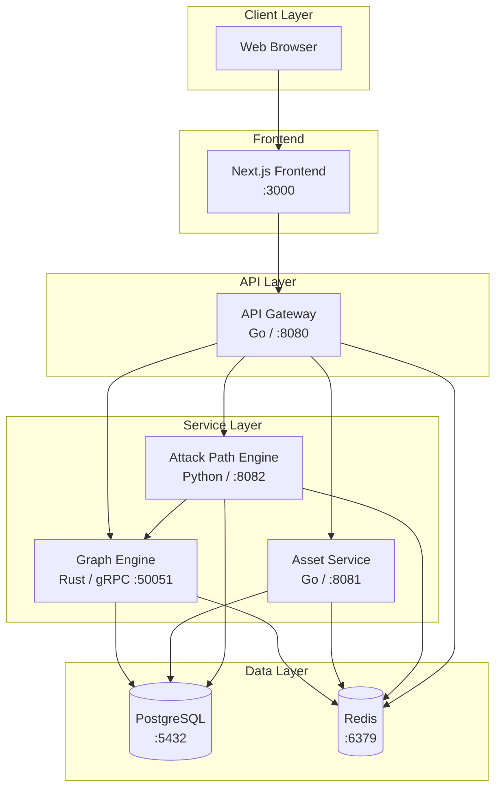
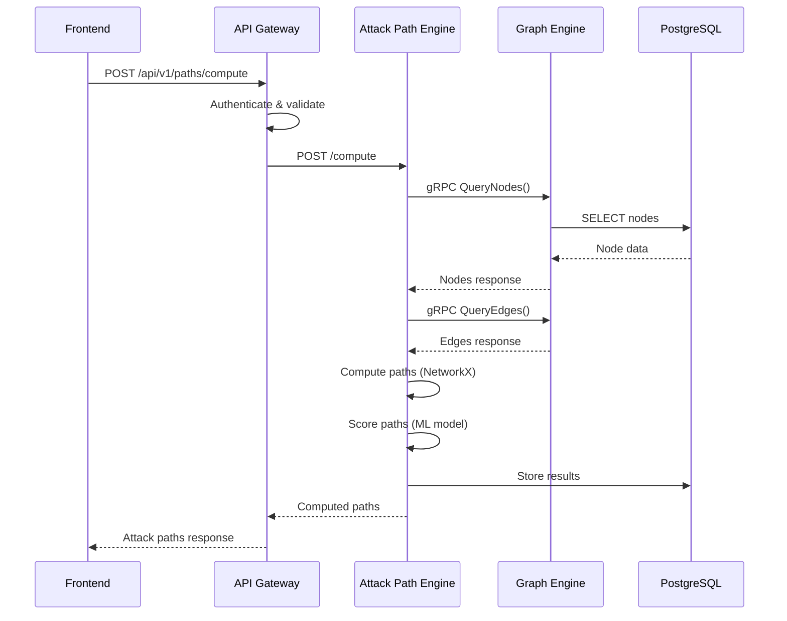
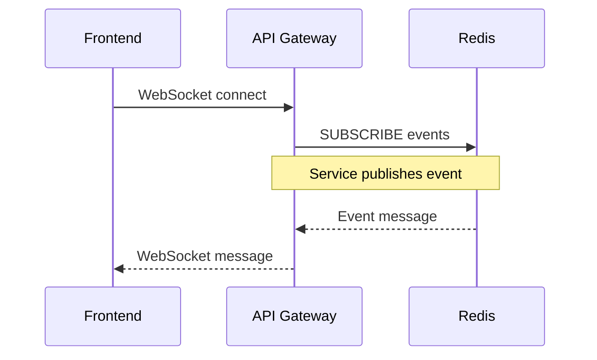

# ARES-X Architecture

## System Overview

ARES-X is a microservices-based platform for attack path analysis and threat simulation. The system is designed for high performance, scalability, and security, using language-specific optimizations for each service domain.

## System Diagram

## Service Descriptions

### Frontend (Next.js)

**Technology:** Next.js 14, React, TypeScript, Tailwind CSS

**Responsibilities:**
- Server-side rendered dashboard with real-time updates
- Interactive graph visualization using D3.js or similar
- Asset inventory management UI
- Attack path visualization and exploration
- Simulation configuration and results display
- User authentication flows

**Communication:** REST/WebSocket to API Gateway

### API Gateway (Go)

**Technology:** Go, Chi router, gRPC-Gateway

**Responsibilities:**
- Single entry point for all client requests
- JWT-based authentication and authorization
- Request validation and rate limiting
- Protocol translation (REST to gRPC for Graph Engine)
- WebSocket management for real-time updates
- Request/response logging and metrics
- CORS handling

**Communication:**
- Receives: HTTP/REST, WebSocket from Frontend
- Sends: gRPC to Graph Engine, HTTP/REST to Asset Service and Attack Path Engine

### Graph Engine (Rust)

**Technology:** Rust, Tonic (gRPC), petgraph

**Responsibilities:**
- High-performance in-memory graph storage
- Graph traversal algorithms (BFS, DFS, Dijkstra)
- Blast radius computation
- Critical node identification (betweenness centrality, PageRank)
- Path finding between nodes
- Graph data persistence to PostgreSQL

**Communication:**
- Receives: gRPC from API Gateway, gRPC from Attack Path Engine
- Connects to: PostgreSQL for persistence, Redis for caching

### Asset Service (Go)

**Technology:** Go, GORM, PostgreSQL

**Responsibilities:**
- CRUD operations for infrastructure assets
- Asset categorization and tagging
- Criticality scoring
- Bulk import/export (CSV, JSON)
- Full-text search across asset properties
- Asset relationship tracking

**Communication:**
- Receives: HTTP/REST from API Gateway
- Connects to: PostgreSQL for storage, Redis for caching

### Attack Path Engine (Python)

**Technology:** Python, FastAPI, NetworkX, scikit-learn

**Responsibilities:**
- Attack path computation using graph algorithms
- MITRE ATT&CK TTP mapping
- ML-based path likelihood scoring
- Threat simulation execution
- Path prioritization and ranking
- Mitigation recommendations

**Communication:**
- Receives: HTTP/REST from API Gateway
- Sends: gRPC to Graph Engine for graph data
- Connects to: PostgreSQL for storage, Redis for caching/queues

## Communication Patterns

### Synchronous Communication

| Source | Target | Protocol | Purpose |
|--------|--------|----------|---------|
| Frontend | API Gateway | HTTP/REST | All API requests |
| Frontend | API Gateway | WebSocket | Real-time updates |
| API Gateway | Graph Engine | gRPC | Graph queries |
| API Gateway | Asset Service | HTTP/REST | Asset CRUD |
| API Gateway | Attack Path Engine | HTTP/REST | Path analysis |
| Attack Path Engine | Graph Engine | gRPC | Graph data access |

### Asynchronous Communication

| Source | Target | Medium | Purpose |
|--------|--------|--------|---------|
| Asset Service | Graph Engine | Redis Pub/Sub | Asset change events |
| Attack Path Engine | API Gateway | Redis Pub/Sub | Simulation progress |
| API Gateway | Frontend | WebSocket | Real-time notifications |

## Data Flow

### Attack Path Computation Flow

### Real-time Update Flow

## Security Model

### Authentication

- **JWT Tokens:** Short-lived access tokens (1 hour) with refresh tokens (7 days)
- **MFA Support:** TOTP, SMS, and email-based second factor
- **Session Management:** Redis-backed sessions with automatic expiry

### Authorization

- **Role-Based Access Control (RBAC):**
  - Admin: Full system access
  - Analyst: Read/write access to analysis features
  - Operator: Read/write access to asset management
  - Executive: Read-only dashboard access
  - ReadOnly: View-only access

### Network Security

- TLS encryption for all external communication
- mTLS between services in production
- Network policies restricting inter-service communication
- Rate limiting at the API Gateway level

### Data Security

- Encryption at rest for PostgreSQL (AES-256)
- Secrets management via Kubernetes Secrets (production: external secrets operator)
- Audit logging for all data modifications
- PII minimization and data retention policies

## Scalability Considerations

### Horizontal Scaling

- Frontend, API Gateway, Asset Service, and Attack Path Engine scale horizontally
- Graph Engine maintains in-memory state; scaled via sharding
- PostgreSQL uses read replicas for read-heavy workloads
- Redis cluster mode for high availability

### Performance Targets

| Metric | Target |
|--------|--------|
| API Response Time (p95) | < 200ms |
| Graph Query (p95) | < 100ms |
| Path Computation (avg) | < 5s |
| Simulation (avg) | < 30s |
| Dashboard Load | < 2s |
| Concurrent Users | 500+ |

## Deployment Architecture

### Development

- Docker Compose for local development
- Hot reloading for all services
- Shared PostgreSQL and Redis instances

### Production

- Kubernetes (EKS/GKE/AKS)
- Ingress controller with TLS termination
- Horizontal Pod Autoscaler for services
- StatefulSet for PostgreSQL
- Managed Redis (ElastiCache/Memorystore) recommended for production
